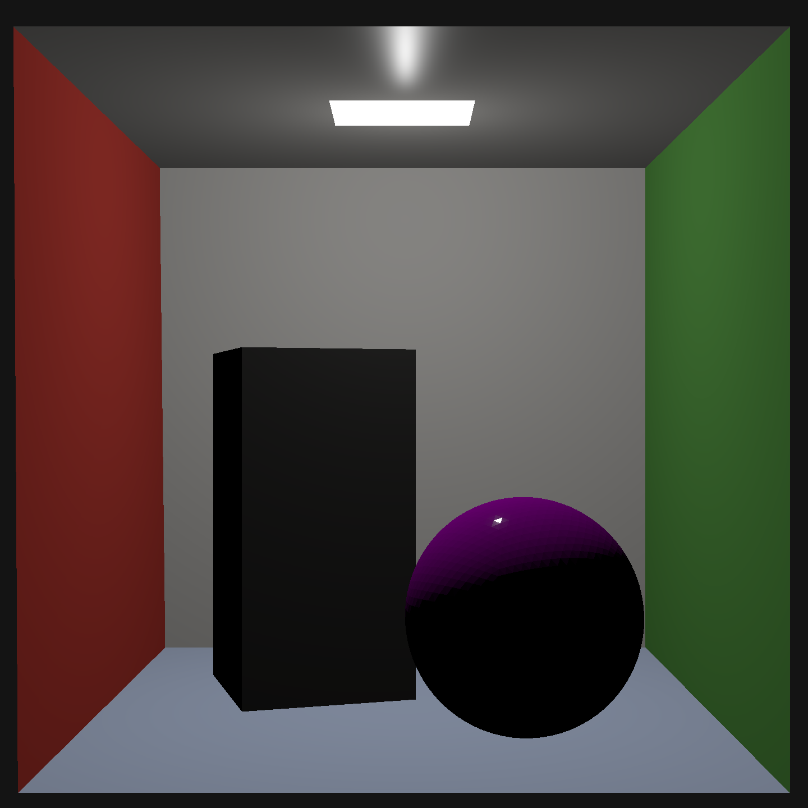
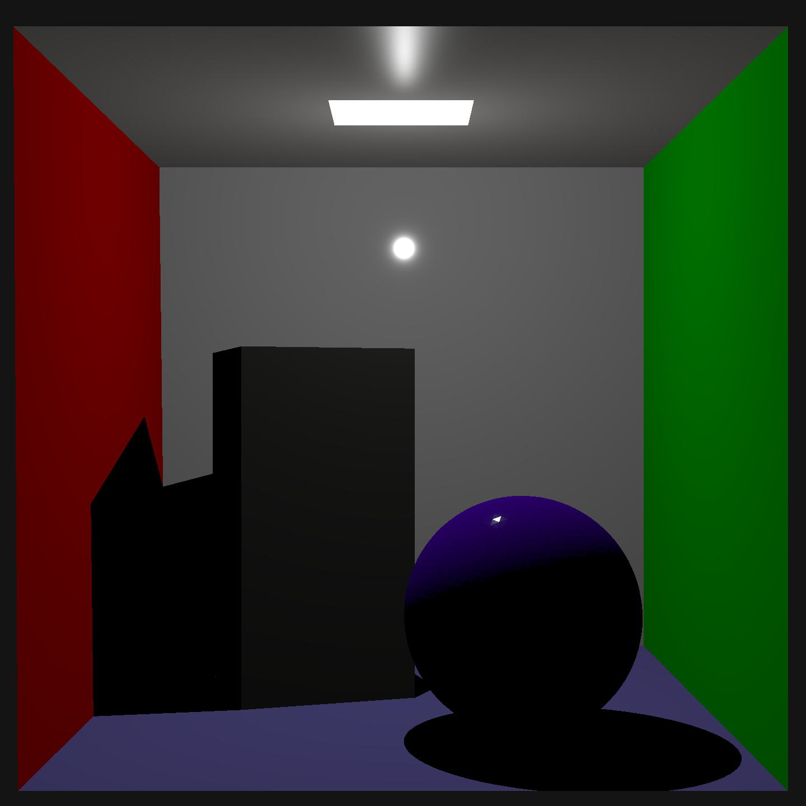

# NI-PG1 Matej Zeman (zemanm40) 2026

My Sara raytracer in numba-cuda.

## Structure

Separate homeworks are in the folders, merged from branch with the same name.
Use `run_local.sh hw0x` script to run specific homework (on linux). I managed to run it on FIT cluster as well.

The output will be in the homework folder as `output.ppm/png`.

### TinyObjLoader

I use the c++ header tiny-obj-loader library together with python bindings. I parsed the triangles there too. So user on different machine needs to recompile it for there is older version of python on the cluster or your device.

Use `./rebuild_tinyobjloader.sh` for compilation from the root directory. Note: For each homework branch may be different version of the library. So recompiling is adviced.

## Render Times

Testing on my box-advanced with +-5000 triangles.
The meassurements assume the data is already on gpu.

> Dimensions per machine:
> - 1440**2 on local rtx3070 mobile.
> - 5760**2 on remote A100 on cluster.

## Homework render times:
Pure rendering on both machines:
| hw  | local  | remote | note    |
| --- | ------ | ------ | ------- |
| 1   | 2.26 s | 1.18 s | cook    |
| 2   | x.xx s | x.xx s | SAH BVH |
| 3   | x.xx s | x.xx s |         |
| 4   | x.xx s | x.xx s |         |
| 5   | x.xx s | x.xx s |         |

## Homework renders

***

***

