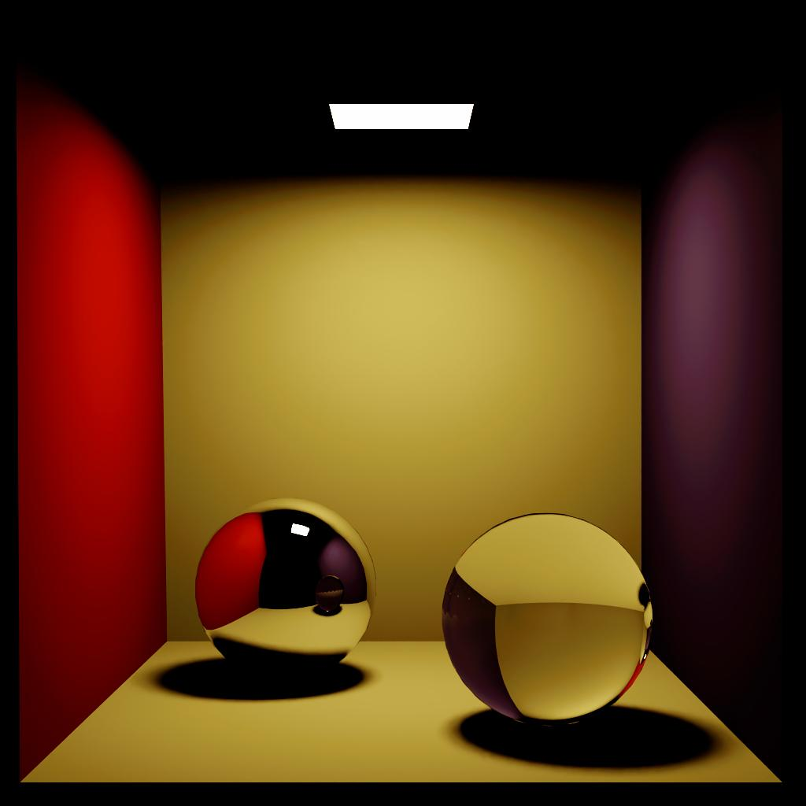
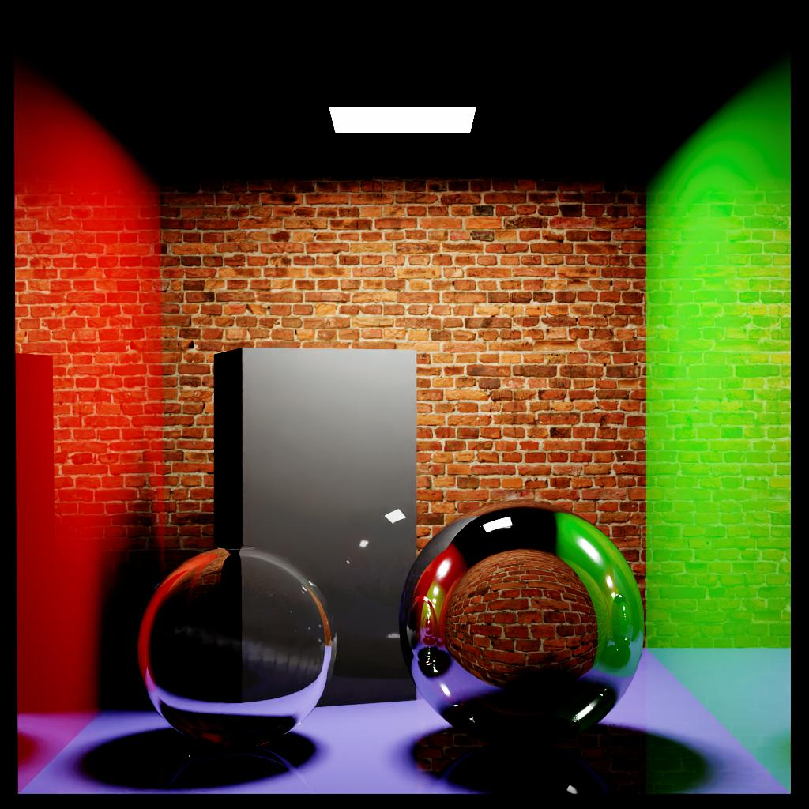
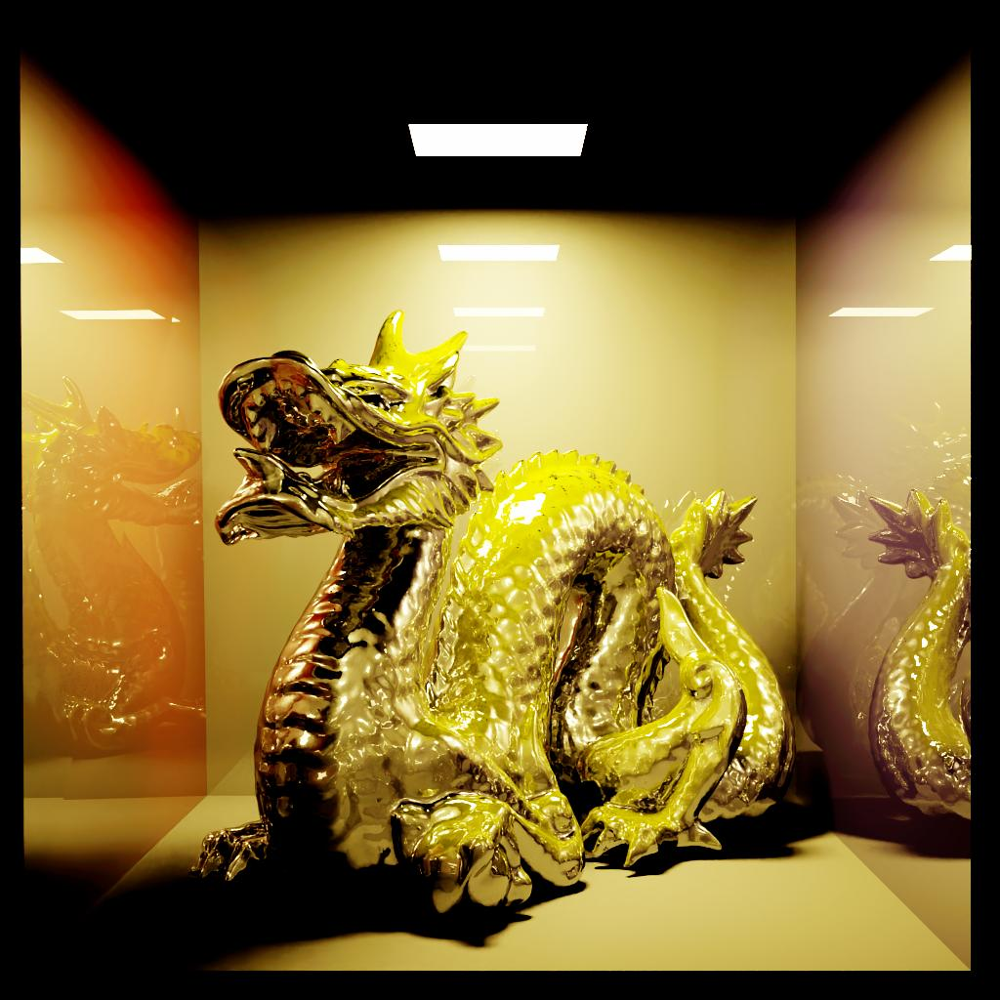
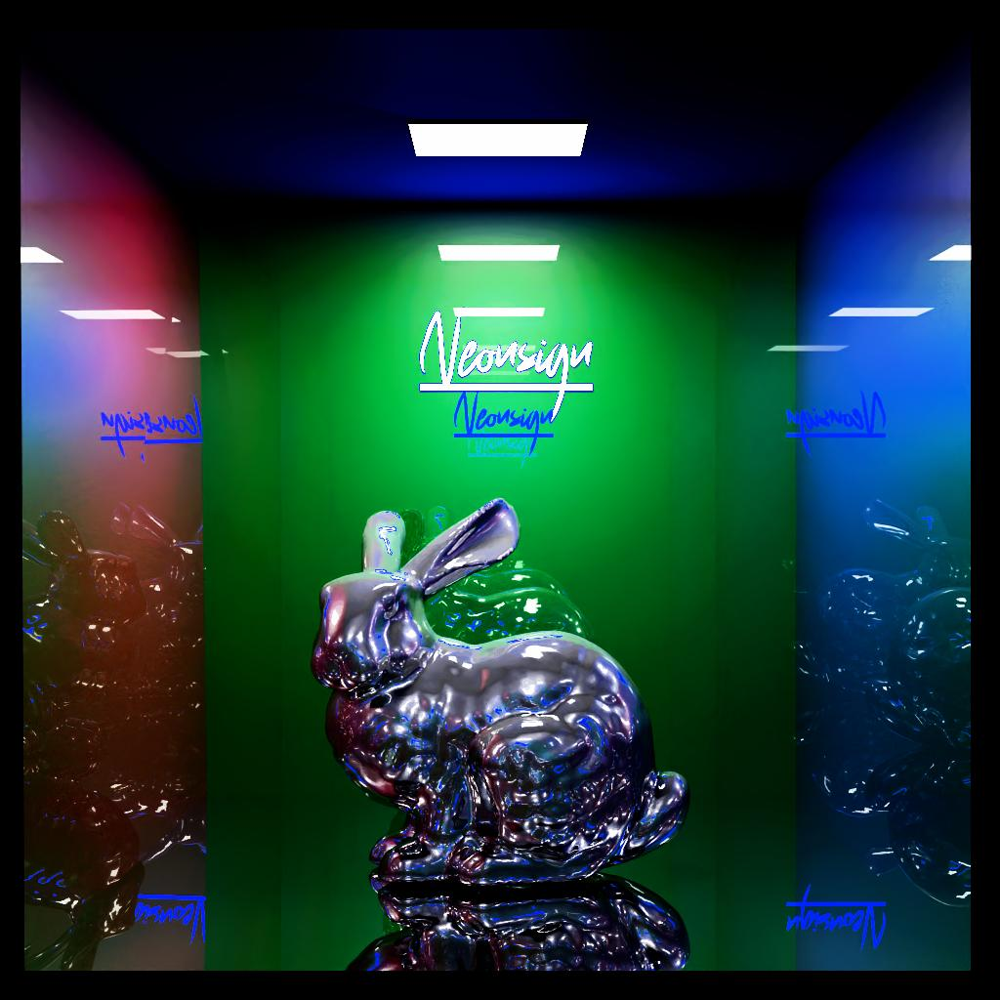
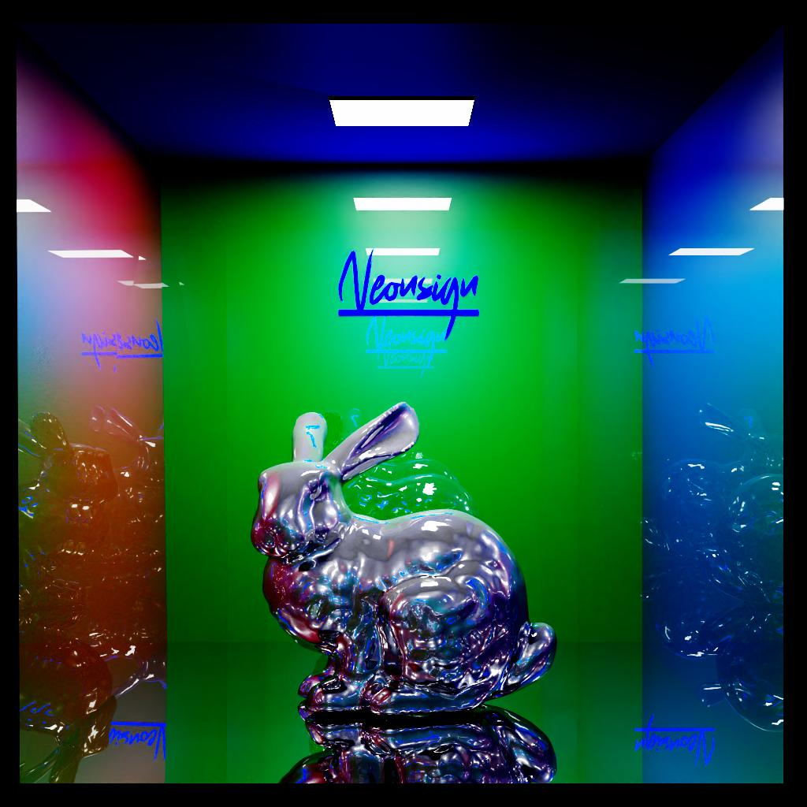
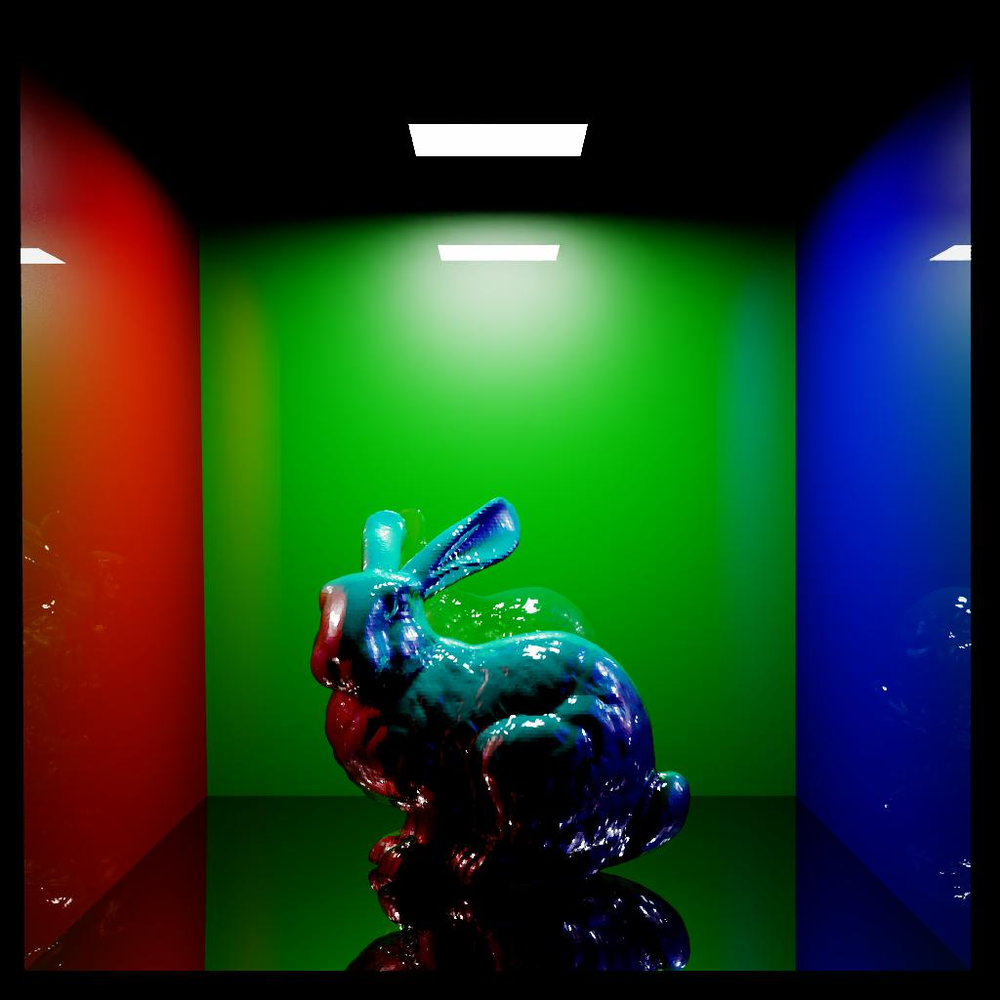

# Sara — Numba-CUDA Ray Tracer

GPU-accelerated ray tracing in Python using Numba JIT compilation. Wavefront-scattered ray traversal (on the `gpu` branch), binned SAH BVH, and multiple tonemappers.

**Author:** Matěj Zeman (zemanm40) · **Subject:** NI-PG1 — Počítačová Grafika 1 · **Teacher:** Ing. Radek Richtr, Ph.D. · **Institution:** CTU FIT Prague

[report pdf](report.pdf)

## First Run

To set up the project locally, please follow these steps:

1. **Compile Pybind11 / TinyObjLoader extension:**
   Run the build script to compile the fast C++ obj loader:
   ```bash
   ./scripts/build_tinyobjloader.sh
   ```
2. **Generate the Tone-mapper LUT:**
   Run the color management script to generate the ACEScg/sRGB lookup tables locally:
   ```bash
   python color-management/generate-lut.py
   ```

## Project Structure

| Directory / File    | Description                                                                                  |
| ------------------- | -------------------------------------------------------------------------------------------- |
| `color-management/` | LUTs and scripts for tonemapping and color space conversion (ACEScg).                        |
| `scenes/`           | Various test scenes in .obj format (`bunny`, `dragon`, `box`, etc.) and configuration JSONs. |
| `scripts/`          | Shell scripts to run benchmarks, build dependencies, or profile.                             |
| `src/`              | Main python codebase for the raytracer (bvh, materials, kernel, shading).                    |
| `tests/`            | Unit and integration tests for metrics and tonemapping.                                      |
| `utils/`            | External dependencies and loaders (e.g. C++ tinyobjloader).                                  |
| `requirements.txt`  | Python dependencies.                                                                         |

## Quick Start

### Prerequisites

- Python 3.14+ (conda recommended)
- NVIDIA GPU with CUDA toolkit
- C++ compiler (for tinyobjloader bindings)

### Conda setup (recommended)

```bash
conda create -n raytracer python=3.14 -y
conda activate raytracer
pip install -r requirements.txt
./scripts/build_tinyobjloader.sh python3.14
```

### Pip setup (no conda)

```bash
python3.14 -m venv .venv
source .venv/bin/activate
pip install -r requirements.txt
./scripts/build_tinyobjloader.sh python3.14
```

### Intel OIDN (optional, for denoising)

Download from [OpenImageDenoise releases](https://github.com/OpenImageDenoise/oidn/releases). Extract `liboidn.so` (Linux) and place it on your `LD_LIBRARY_PATH` or in your Python/lib directory. The renderer skips denoising if OIDN is not found.

### Optional conda packages

For profiling and CUDA development:

```bash
conda install -c nvidia ncu ncu-ui cudatoolkit>=11.0 -y
```

### Run a scene

```bash
./scripts/run_local.sh box-advanced
```

Output images land in `src/output/` as `.jpg` (default) or `.png` / `.ppm`.

## Command-line arguments

Override any setting at runtime with `--key value`:

```bash
python -m src.main --help
python -m src.main --scene bunny
python -m src.main --scene bunny --samples 64 --tonemapper khronos --denoise false
python -m src.main --scene dragon --samples 8 --resolution 512
```

All options: `--scene`, `--samples`, `--max-bounces`, `--resolution`, `--exposure-compensation`, `--tonemapper`, `--format`, `--device`, `--denoise`, `--help`.

## Scene list

| Scene          | Triangles | Notes                                     |
| :------------- | --------: | :---------------------------------------- |
| `box-advanced` |    ~5,500 | Default scene (materials, brick textures) |
| `box-spheres`  |      ~200 | Simple test scene with spheres and a box  |
| `bunny`        |   ~70,000 | Stanford bunny, high triangle count       |
| `dragon`       |  ~871,000 | Stanford dragon, extreme BVH stress test  |

## Renders

### Homework progress

|                              hw01                               |                              hw02                               |
| :-------------------------------------------------------------: | :-------------------------------------------------------------: |
|  |  |

|                              hw03                               |                              hw04                               |
| :-------------------------------------------------------------: | :-------------------------------------------------------------: |
|  |  |

|                                                                                                         hw05                                                                                                         |                                                                                                                  hw06                                                                                                                  |
| :------------------------------------------------------------------------------------------------------------------------------------------------------------------------------------------------------------------: | :------------------------------------------------------------------------------------------------------------------------------------------------------------------------------------------------------------------------------------: |
|    |    |

### Tonemappers

all on bunny, 16 samples, 1024×1024, denoise ON

|                              custom                               |                                narkowicz                                |                               khronos                               |
| :---------------------------------------------------------------: | :---------------------------------------------------------------------: | :-----------------------------------------------------------------: |
|  |  |  |

|                             hill                              |                             none                              |                               magenta                               |
| :-----------------------------------------------------------: | :-----------------------------------------------------------: | :-----------------------------------------------------------------: |
|  |  |  |

## Numba vs CUDA C++

CUDA C++ and Numba share the same GPU programming model, but the API and compilation approach differ.

### nvcc flags → Numba equivalents

| nvcc flag         | Numba equivalent                 | Notes                                                                                                     |
| :---------------- | :------------------------------- | :-------------------------------------------------------------------------------------------------------- |
| `-O3`             | *(default)*                      | Numba uses LLVM and applies full optimization automatically.                                              |
| `-lineinfo`       | `@cuda.jit(lineinfo=True)`       | Links PTX back to Python source lines for Nsight Compute (no performance cost).                           |
| `-G`              | `@cuda.jit(debug=True)`          | Adds assertions and bounds checks — significantly slows down execution.                                   |
| `-maxrregcount=X` | `@cuda.jit(max_registers=X)`     | Limits registers per thread to improve occupancy.                                                         |
| `-arch / -code`   | *(auto-detected)*                | Numba is JIT — it detects the target architecture (e.g. `sm_86`) at runtime.                              |
| `-use_fast_math`  | `@cuda.jit(fastmath=True)`       | Enables HW optimizations: flushes subnormals to zero (FTZ), uses faster (less precise) division and sqrt. |
| `-restrict`       | *(always assumed)*               | Numba assumes arrays do not overlap.                                                                      |
| `--ptxas-options` | `@cuda.jit(ptxas_options=[...])` | Passes flags directly to the PTX assembler (e.g. `['-v', '-dlcm=cg']`).                                   |

### Memory and function types

| CUDA C++                  | Numba                                                                                         |
| :------------------------ | :-------------------------------------------------------------------------------------------- |
| `__global__`              | `@cuda.jit` (global kernel launched from CPU)                                                 |
| `__device__`              | `@cuda.jit(device=True)` (helper callable only from GPU)                                      |
| `__shared__ float arr[N]` | `cuda.shared.array(shape, dtype)` inside a kernel                                             |
| Local memory / stack      | `cuda.local.array(shape, dtype)` — per-thread private storage, often spilled to global memory |

### Conditional compilation

C++ uses `#ifdef` and `#define` macros. Numba has no preprocessor — instead it evaluates compile-time constants and prunes dead code at JIT time:

```python
DEBUG_MODE = False  # global constant

@cuda.jit
def my_kernel():
    if DEBUG_MODE:
        # This code is removed from the final PTX entirely
        assert some_condition
```

This is equivalent to `#ifdef DEBUG_MODE` in C++.

### MTL → Ray Tracer Mapping

| MTL property | Meaning (MTL)                 | Typical ray tracer interpretation  | Notes / pitfalls                                |
| ------------ | ----------------------------- | ---------------------------------- | ----------------------------------------------- |
| `Kd`         | Diffuse color (albedo)        | `albedo_diffuse`                   | Directly used in Lambertian term                |
| `map_Kd`     | Diffuse texture               | `albedo_texture`                   | Sample instead of constant `Kd`                 |
| `Ks`         | Specular color                | `specular_color` or reflectivity   | Often used as Fresnel base or specular weight   |
| `Ns`         | Specular exponent (shininess) | `roughness` or `phong_exponent`    | Usually converted: `roughness ≈ sqrt(2/(Ns+2))` |
| `Ke`         | Emission color                | `emission` / light source radiance | Non-zero → treat as light                       |
| `Ni`         | Index of refraction           | `ior`                              | Used for refraction (Snell's law)               |
| `d`          | Opacity (1 = opaque)          | `opacity` / `alpha`                | If `<1`, enable transparency                    |
| `Tf`         | Transmission filter (color)   | `transmittance_color`              | Tints refracted rays                            |
| `illum`      | Illumination model            | shading mode flags                 | Often ignored                                   |

#### Observations

- `Ns` from Blender can be very large (e.g. 800+) → must be remapped to roughness, otherwise highlights become numerically unstable
- `Ks` is **not physically correct reflectivity** → treat it as a heuristic weight, not energy-conserving
- `Tf` is often misused → if absent, assume white transmission `(1,1,1)`

## Key Architecture Decisions

### GPU vs CPU

The core rendering pipeline runs entirely on GPU. CPU tasks are support steps:

| What                                     | Where          | How                                                      |
| ---------------------------------------- | -------------- | -------------------------------------------------------- |
| Scene loading / parsing                  | CPU (optional) | TinyObjLoader C++ via pybind11                           |
| BVH construction                         | CPU            | SAH binning in `bvh.py`                                  |
| Ray tracing (primary, secondary, shadow) | GPU            | Numba kernels in `render_kernel.py`                      |
| BVH traversal                            | GPU            | `traversal.py` — per-thread stack via `cuda.local.array` |
| Intersection test                        | GPU            | Möller–Trumbore in `intersection.py`                     |
| Accumulation + reduction                 | GPU            | Adds into HDR framebuffer                                |
| Denoising                                | CPU (optional) | Intel OIDN library in `denoiser.py`                      |
| SRGB + save                              | CPU            | `framebuffer.py`                                         |

All ray tracing is executed on GPU with the entire kernel launched from CPU host code. CPU tasks (scene loading, BVH build, post-processing) are prepared on the host but do not participate in the core rendering loop.

### BVH

The BVH is built on CPU using SAH binning, then uploaded to GPU as flat arrays. GPU traversal uses a per-thread local stack (`cuda.local.array`). A proper BVH reduces intersection ops from ~800k per ray to ~50 per ray on complex meshes.

## Performance Summary

All benchmarks on NVIDIA A100-PCIE-40GB, 1024×1024, 16 samples, 16 bounces. Render times exclude JIT compilation and BVH build.

| Scene       | Config       | BVH Build (s) | Render (s) | MRays/s | Node/Hit | Tri/Hit |
| :---------- | :----------- | ------------: | ---------: | ------: | -------: | ------: |
| box-spheres | sah-binning  |          5.63 |       0.78 |    2.68 |     0.11 |    0.05 |
| bunny       | sah-binning  |          6.76 |      36.04 |    0.10 |     14.7 |    0.08 |
| bunny       | median-split |          5.31 |       7.60 |    0.46 |     73.4 |    0.41 |
| bunny       | no-binning   |        508.92 |       2.03 |    1.72 |      0.0 |    0.08 |
| dragon      | sah-binning  |         20.05 |     700.79 |    0.01 |     13.1 |    0.01 |

> BVH build times are CPU-only. Without BVH, per-ray intersection is O(n) — the bunny scene without BVH averages 279,967 triangle tests per hit pixel vs 77 with BVH.


## Python Debugging in VS Code

Use `.vscode/launch.json`:

```json
{
    "version": "0.2.0",
    "configurations": [
        {
            "name": "debug raytracer",
            "type": "debugpy",
            "request": "launch",
            "module": "src.main",
            "console": "integratedTerminal",
            "cwd": "${workspaceFolder}",
            "env": {
                "PYTHONPATH": "${workspaceFolder}:${workspaceFolder}/src"
            }
        }
    ]
}
```

## Dependencies

| Package          | Purpose                            |
| :--------------- | :--------------------------------- |
| `numba`          | CUDA JIT compiler (LLVM backend)   |
| `numpy`          | Array operations                   |
| `pybind11`       | C++ bindings for tinyobjloader     |
| `pillow`         | PNG/JPG image output               |
| `colour-science` | Tonemapper LUT generation          |
| `oidn`           | Optional: Intel Open Image Denoise |

## License

MIT License — see [LICENSE](LICENSE).

TinyObjLoader is used under the MIT License (© 2012–2023 Syoyo Fujita).
