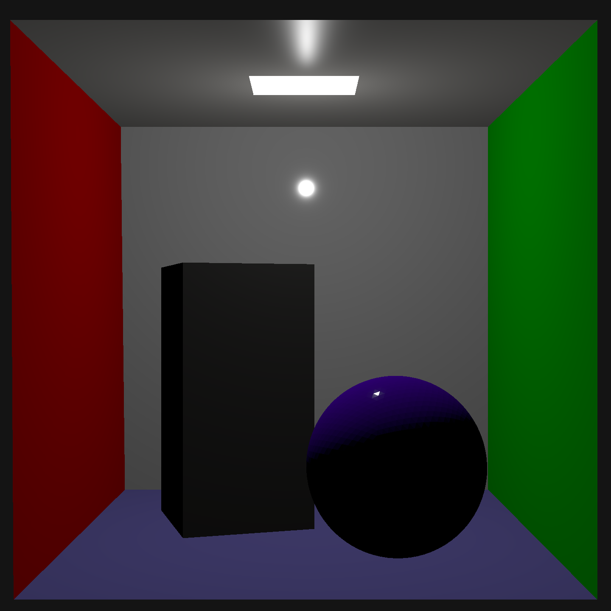
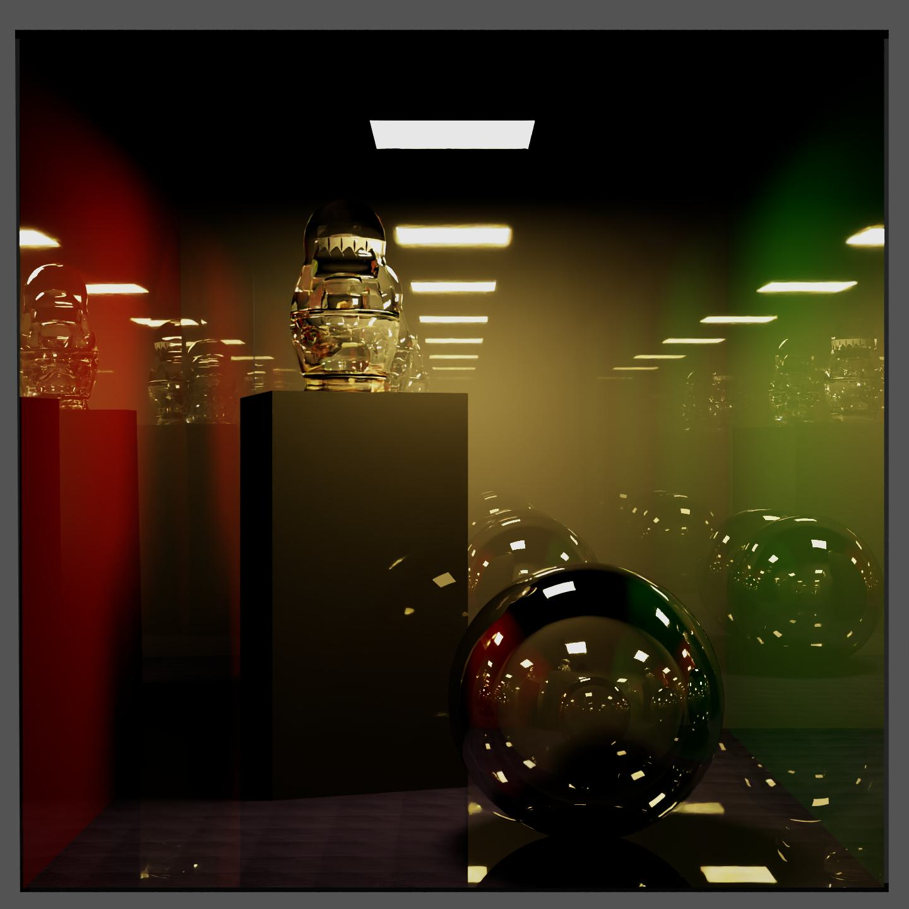
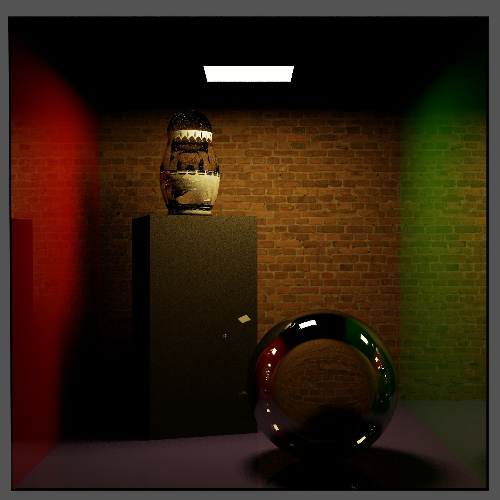
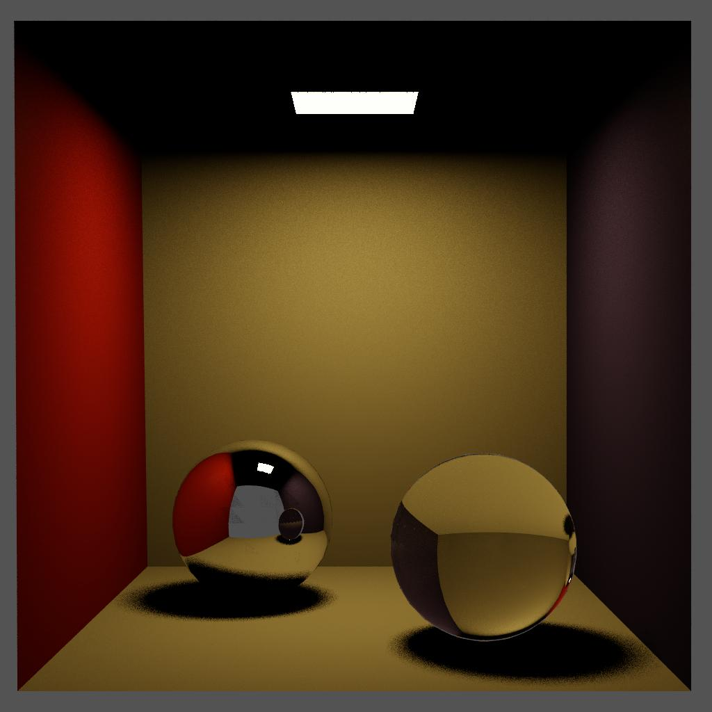
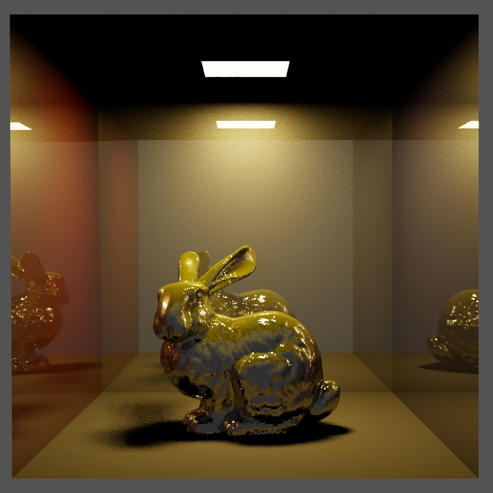
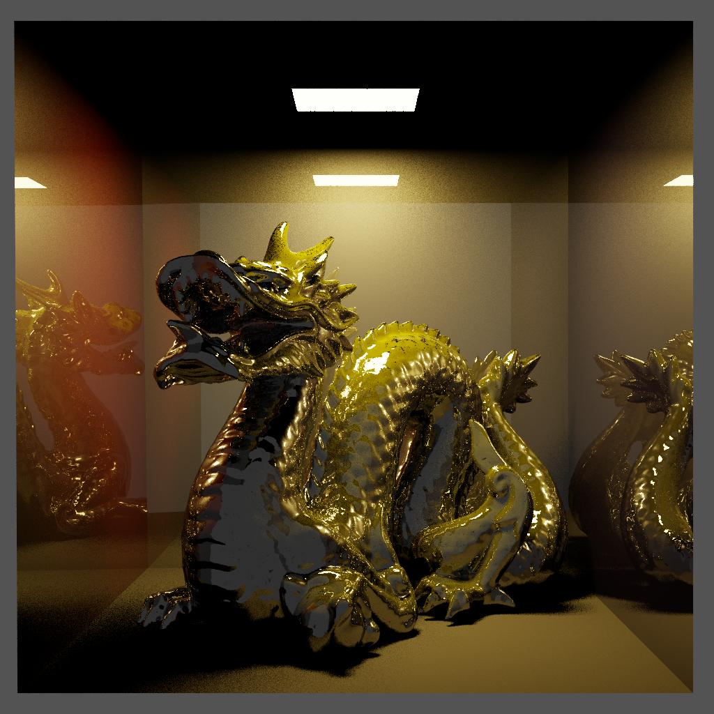
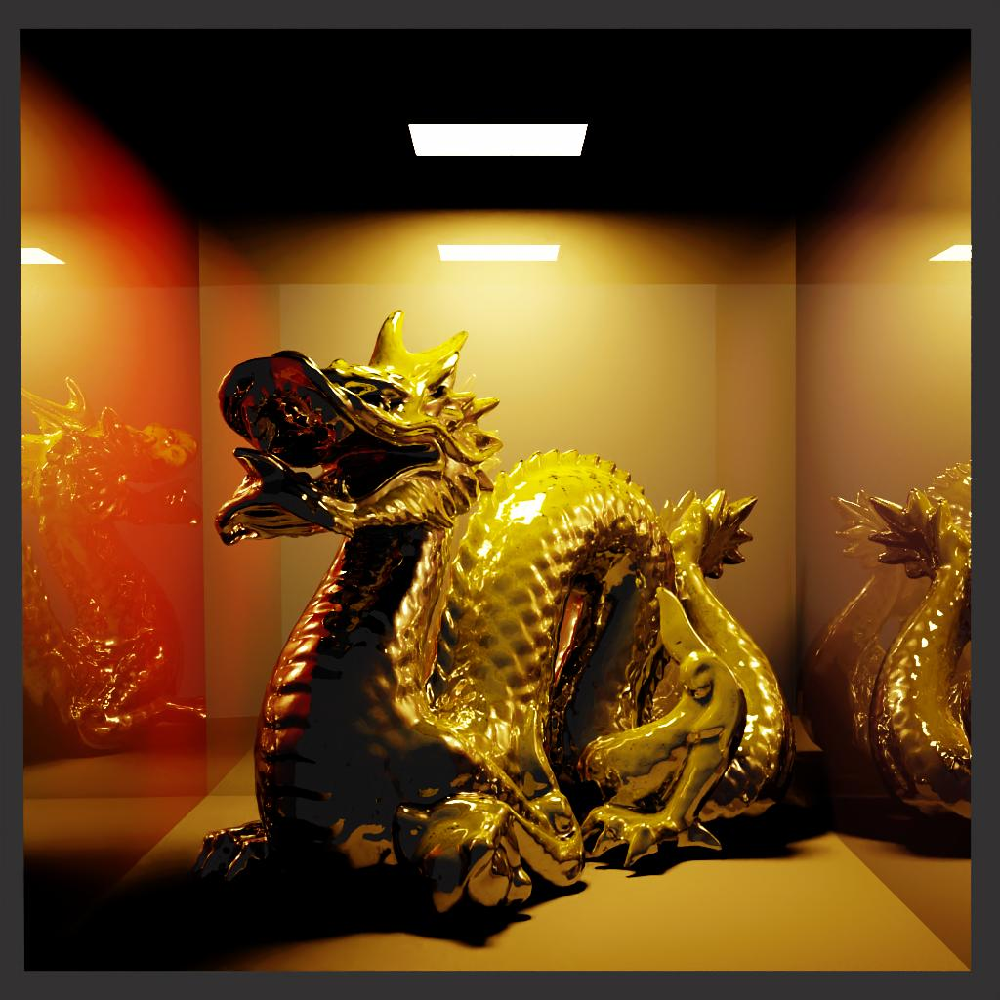
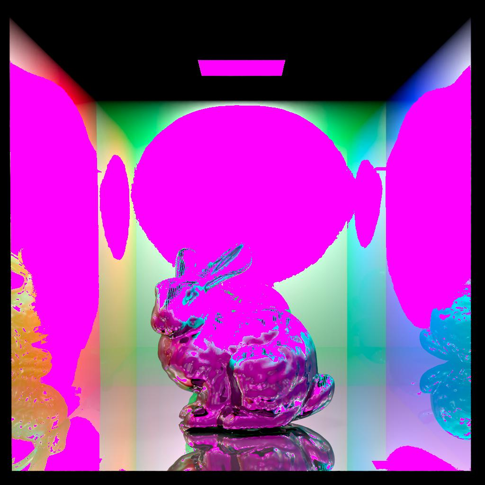
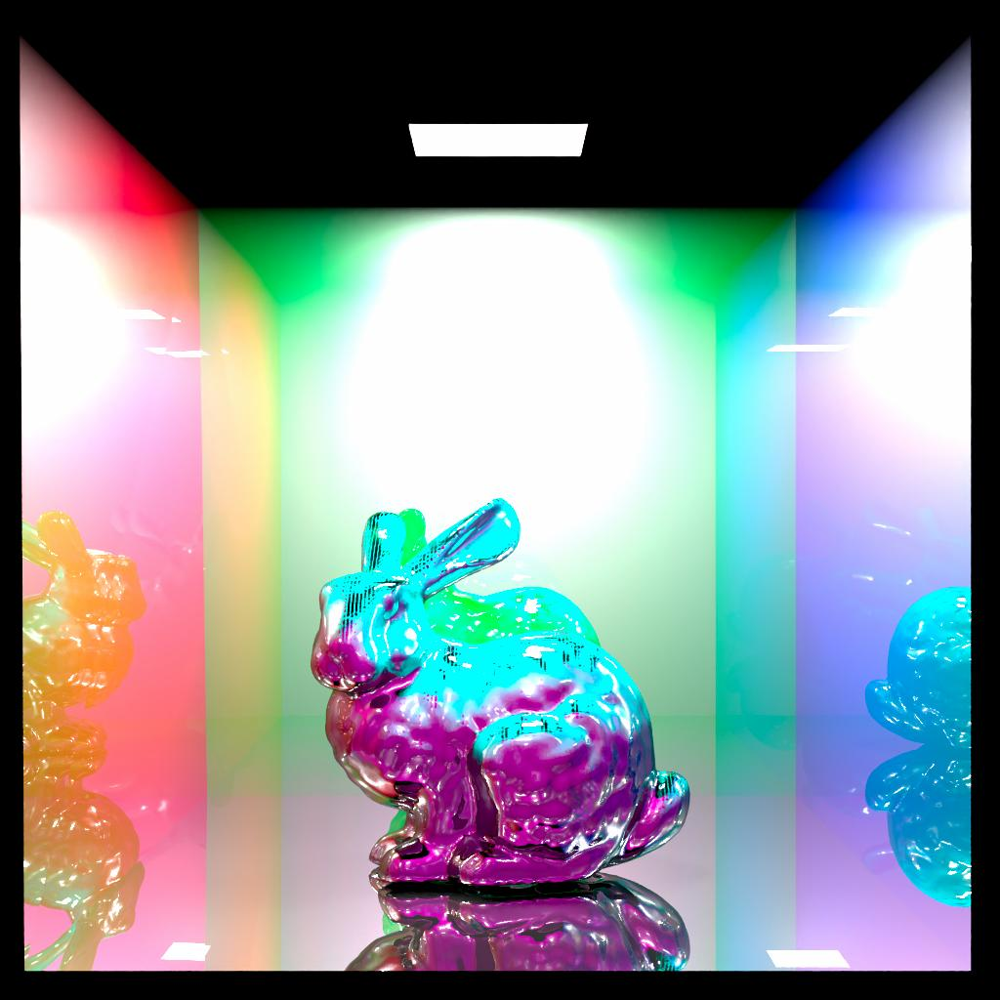
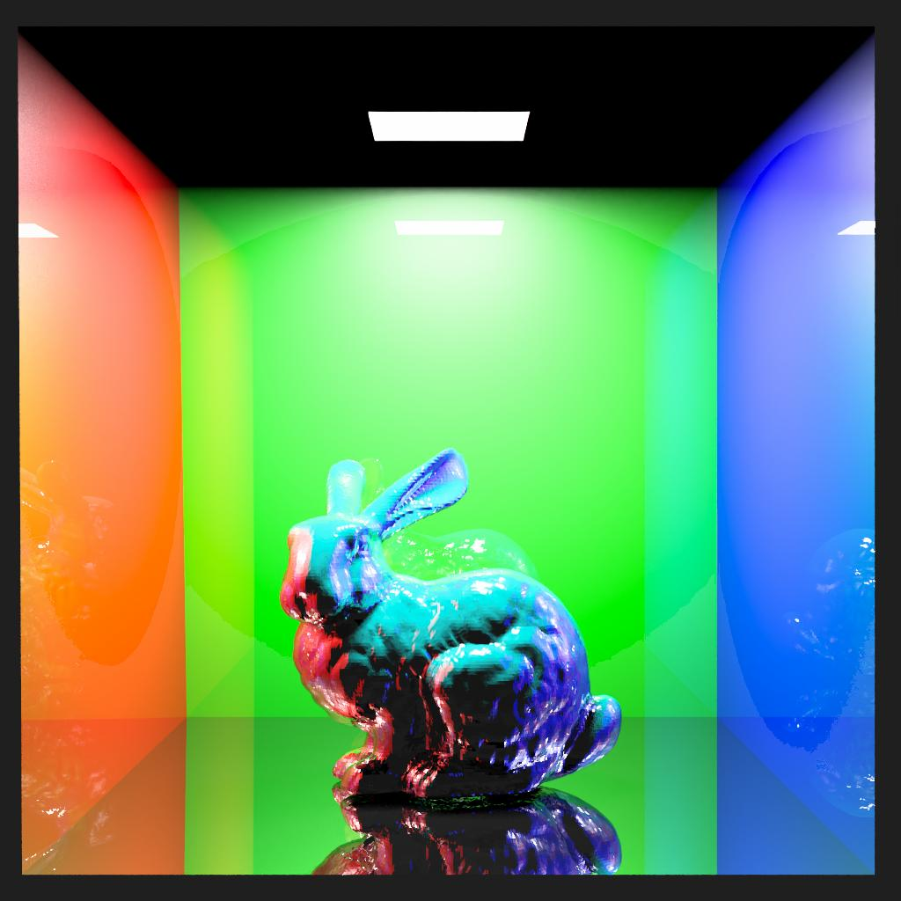

# CTU FIT NI-PG1 Matej Zeman (zemanm40) 2026

My Sara raytracer in numba-cuda. Semestral work in PG1 taught by Ing. Radek Richtr Ph.D on CTU FIT in Prague.

## Structure/Installation

Separate homeworks are in the branches (hw0x). The main source code is inside `src/` folder. It is using my `utils/` module.

For Python package on local machine, I use conda venv called 'raytracer'. Use `run_local.sh` script to run specific branch.

I managed to run it on FIT cluster as well with using standard `.venv/` installed from `requirements.txt`
If you do not have conda package manager, build your `.venv` form `requirements.txt`.
OIDN is optional; without it the renderer still runs and simply skips the denoise pass.


The output will be in the `src/output/` folder as `output.ppm/png/jpg`.

### TinyObjLoader

I use the c++ header tiny-obj-loader library together with python bindings. I parsed the triangles there too. So user on different machine needs to recompile it for there is older version of python on the cluster or your device.

Use `./build_tinyobjloader.sh.sh python3.<version>` for compilation from the root directory. Note: For each homework branch may be different version of the library. So recompiling when switching branches is adviced. You can specify your version of python to compile for, but default is `python3.14`.


## Homework renders




***




***





***








## Render Times

Testing on my box-advanced with +-5500 triangles.
The meassurements assume the data is already on gpu.

> Dimensions per machine:
> - 1440**2 on local rtx3070 mobile.
> - 5760**2 on remote A100 on cluster.
> - The scenes are ussualy 5 units (blender meters) tall.


## BVH Performance (GPU-side Metrics)

> Device: NVIDIA GeForce RTX 3090 / 16 CPU cores


Resolution is `1024x1024`, samples are `16`, and max bounces are `16`.

| Scene       | Config       | Construction (s) | node_tests (mean) | tri_tests (mean) | shadow_tests (mean) |
| :---------- | :----------- | ---------------: | ----------------: | ---------------: | ------------------: |
| bunny       | sah-binning  |           4.1600 |            892.42 |            77.26 |               19.82 |
| bunny       | median-split |           5.3100 |           2903.43 |           413.77 |               19.83 |
| bunny       | no-binning   |         508.9200 |            775.11 |            79.97 |               19.82 |
| box-spheres | sah-binning  |           3.3900 |            454.18 |            52.85 |               13.34 |
| box-spheres | median-split |           3.3800 |           1244.35 |           251.61 |               13.35 |
| box-spheres | no-binning   |           3.8400 |            342.40 |            51.83 |               13.35 |

### Construction Metrics

| Scene       | Config       | Const (s) |  Nodes | Internal | Leaves | Leaf Depth (min/max) | Prims/leaf (min/max) |
| :---------- | :----------- | --------: | -----: | -------: | -----: | :------------------- | :------------------- |
| bunny       | sah-binning  |    4.1600 | 76,907 |   38,453 | 38,454 | 0 / 17 / 8.3         | 1 / 5 / 1.8          |
| bunny       | median-split |    5.3100 | 73,431 |   36,715 | 36,716 | 0 / 16 / 7.8         | 1 / 5 / 1.9          |
| bunny       | no-binning   |  508.9200 | 75,055 |   37,527 | 37,528 | 0 / 16 / 8.7         | 1 / 5 / 1.9          |
| box-spheres | sah-binning  |    3.3900 |  2,183 |    1,091 |  1,092 | 0 / 11 / 5.7         | 1 / 4 / 2.0          |
| box-spheres | median-split |    3.3800 |  2,357 |    1,178 |  1,179 | 0 / 11 / 5.3         | 1 / 20 / 1.9         |
| box-spheres | no-binning   |    3.8400 |  2,131 |    1,065 |  1,066 | 0 / 11 / 5.7         | 1 / 4 / 2.0          |

### Traversal Metrics

| Scene       | Config       | Hit % | node_tests | tri_tests | shadow_tests | traverse_tests | query_depth |
| :---------- | :----------- | ----: | ---------: | --------: | -----------: | -------------: | ----------: |
| bunny       | sah-binning  |  89.5 |     892.42 |     77.26 |        19.82 |          29.78 |        4.86 | — |
| bunny       | median-split |  89.5 |    2903.43 |    413.77 |        19.83 |          97.69 |       12.66 | — |
| bunny       | no-binning   |  89.5 |     775.11 |     79.97 |        19.82 |          25.70 |        4.14 | — |
| box-spheres | sah-binning  |  89.5 |     454.18 |     52.85 |        13.34 |          15.26 |        4.75 | — |
| box-spheres | median-split |  89.5 |    1244.35 |    251.61 |        13.35 |          44.90 |        6.53 | — |
| box-spheres | no-binning   |  89.5 |     342.40 |     51.83 |        13.35 |          11.73 |        3.62 | — |

Size of the scene BVH (`.npz`):
- bunny 9.4 MB
- dragon: 120 MB
- box-spheres: 0.3 MB 

## Performance Log:
Saved bash rendering on cpu/gpu with/without BVH:

```bash
SCENE_NAME = "box-spheres"
SAMPLES = 16
DENOISE = False
MAX_BOUNCES = 16

Runs on device: 'NVIDIA A100-PCIE-40GB'
[timing] init python         :    2.43 s
[timing] bvh build           :    5.63 s
[timing] init cuda + alloc   :    0.00 s
[timing] jit compile run     :    4.35 s
[timing] render (no ds)      :    0.78 s

=================================================================
  STATISTICS (No DS on GPU)
=================================================================
Resolution:             1024 x 1024 (1,048,576 pixels)
Render time:            0.780 s
Throughput (whole run): 2.68 MRays/s
-----------------------------------------------------------------
RAY DISTRIBUTION (Total: 2,091,400)
  Primary:               50.1%  (1,048,576)
  Secondary:              8.1%  (168,362)
  Shadow:                41.8%  (874,462)
-----------------------------------------------------------------
WORKLOAD DISTRIBUTION
  Sky (1 ray):           25.0%  (261,677)
  Standard geometry:     70.8%  (742,540)
  Hard (>> avg tests):    4.2%  (44,359)
-----------------------------------------------------------------
BVH EFFICIENCY (Total incidence ops: 4,480,333,476)
  Node/Triangle ratio:  0.0 : 1
  Avg ops per ray:      2142.3
  Avg nodes per ray:    0.0 (Ideal O(logN) ~ 11.1)
-----------------------------------------------------------------

PER_HIT-PIXEL LOAD (min / mean / max)
  Rays calls:        2 / 2.3 / 32
  Incidence tests:   2194 / 4966.1 / 70016
=================================================================

[timing] render (with ds)    :    0.02 s (53.4 FPS)
[timing] copy hdr to host    :    0.01 s
[timing] postprocess (srgb/tonemapper on CPU):    1.98 s

=================================================================
  STATISTICS (DS on GPU)
=================================================================
Resolution:             1024 x 1024 (1,048,576 pixels)
Render time:            2.004 s
Throughput (whole run): 1.04 MRays/s
-----------------------------------------------------------------
RAY DISTRIBUTION (Total: 2,091,807)
  Primary:               50.1%  (1,048,576)
  Secondary:              8.1%  (168,705)
  Shadow:                41.8%  (874,526)
-----------------------------------------------------------------
WORKLOAD DISTRIBUTION
  Sky (1 ray):           25.0%  (261,716)
  Standard geometry:     65.9%  (690,684)
  Hard (>> avg tests):    9.2%  (96,176)
-----------------------------------------------------------------
BVH EFFICIENCY (Total incidence ops: 51,958,437)
  Node/Triangle ratio:  11.2 : 1
  Avg ops per ray:      24.8
  Avg nodes per ray:    22.8 (Ideal O(logN) ~ 11.1)
-----------------------------------------------------------------

PER_HIT-PIXEL LOAD (min / mean / max)
  Rays calls:        2 / 2.3 / 32
  Incidence tests:   32 / 62.2 / 1937
=================================================================

[timing] total (+-)          :   15.39 s

```
***
```bash
SCENE_NAME = "bunny"
SAMPLES = 16
DENOISE = False
MAX_BOUNCES = 16

Runs on device: 'NVIDIA A100-PCIE-40GB'
[timing] init python         :    2.42 s
[timing] bvh build           :    6.76 s
[timing] init cuda + alloc   :    0.00 s
[timing] jit compile run     :    4.40 s
[timing] render (no ds)      :   36.04 s

=================================================================
  STATISTICS (No DS on GPU)
=================================================================
Resolution:             1024 x 1024 (1,048,576 pixels)
Render time:            36.043 s
Throughput (whole run): 0.10 MRays/s
-----------------------------------------------------------------
RAY DISTRIBUTION (Total: 3,492,127)
  Primary:               30.0%  (1,048,576)
  Secondary:             32.8%  (1,144,093)
  Shadow:                37.2%  (1,299,458)
-----------------------------------------------------------------
WORKLOAD DISTRIBUTION
  Sky (1 ray):           24.2%  (254,124)
  Standard geometry:     73.3%  (768,099)
  Hard (>> avg tests):    2.5%  (26,353)
-----------------------------------------------------------------
BVH EFFICIENCY (Total incidence ops: 240,072,560,447)
  Node/Triangle ratio:  0.0 : 1
  Avg ops per ray:      68746.8
  Avg nodes per ray:    0.0 (Ideal O(logN) ~ 16.1)
-----------------------------------------------------------------

PER_HIT-PIXEL LOAD (min / mean / max)
  Rays calls:        2 / 4.1 / 14
  Incidence tests:   69655 / 279967.0 / 972482
=================================================================

[timing] render (with ds)    :    0.03 s (29.5 FPS)
[timing] copy hdr to host    :    0.01 s
[timing] postprocess (srgb/tonemapper on CPU):    1.99 s

=================================================================
  STATISTICS (DS on GPU)
=================================================================
Resolution:             1024 x 1024 (1,048,576 pixels)
Render time:            2.029 s
Throughput (whole run): 1.72 MRays/s
-----------------------------------------------------------------
RAY DISTRIBUTION (Total: 3,491,318)
  Primary:               30.0%  (1,048,576)
  Secondary:             32.8%  (1,143,705)
  Shadow:                37.2%  (1,299,037)
-----------------------------------------------------------------
WORKLOAD DISTRIBUTION
  Sky (1 ray):           24.2%  (254,106)
  Standard geometry:     67.1%  (703,885)
  Hard (>> avg tests):    8.6%  (90,585)
-----------------------------------------------------------------
BVH EFFICIENCY (Total incidence ops: 95,296,081)
  Node/Triangle ratio:  14.7 : 1
  Avg ops per ray:      27.3
  Avg nodes per ray:    25.6 (Ideal O(logN) ~ 16.1)
-----------------------------------------------------------------

PER_HIT-PIXEL LOAD (min / mean / max)
  Rays calls:        2 / 4.1 / 14
  Incidence tests:   36 / 115.9 / 1379
=================================================================

[timing] total (+-)          :   51.87 s
```
***
```bash
SCENE_NAME = "dragon"
SAMPLES = 16
DENOISE = False
MAX_BOUNCES = 16

Runs on device: 'NVIDIA A100-PCIE-40GB'
[timing] init python         :    2.43 s
[timing] bvh build           :   20.05 s
[timing] init cuda + alloc   :    0.00 s
[timing] jit compile run     :    4.39 s
[timing] render (no ds)      :  700.79 s

=================================================================
  STATISTICS (No DS on GPU)
=================================================================
Resolution:             1024 x 1024 (1,048,576 pixels)
Render time:            700.793 s
Throughput (whole run): 0.01 MRays/s
-----------------------------------------------------------------
RAY DISTRIBUTION (Total: 4,115,032)
  Primary:               25.5%  (1,048,576)
  Secondary:             37.7%  (1,552,923)
  Shadow:                36.8%  (1,513,533)
-----------------------------------------------------------------
WORKLOAD DISTRIBUTION
  Sky (1 ray):           24.2%  (254,078)
  Standard geometry:     70.5%  (739,434)
  Hard (>> avg tests):    5.3%  (55,064)
-----------------------------------------------------------------
BVH EFFICIENCY (Total incidence ops: 3,452,975,506,503)
  Node/Triangle ratio:  0.0 : 1
  Avg ops per ray:      839112.7
  Avg nodes per ray:    0.0 (Ideal O(logN) ~ 19.7)
-----------------------------------------------------------------

PER_HIT-PIXEL LOAD (min / mean / max)
  Rays calls:        2 / 4.9 / 14
  Incidence tests:   871986 / 4067465.0 / 12198452
=================================================================

[timing] render (with ds)    :    0.19 s (5.2 FPS)
[timing] copy hdr to host    :    0.00 s
[timing] postprocess (srgb/tonemapper on CPU):    2.00 s

=================================================================
  STATISTICS (DS on GPU)
=================================================================
Resolution:             1024 x 1024 (1,048,576 pixels)
Render time:            2.192 s
Throughput (whole run): 1.88 MRays/s
-----------------------------------------------------------------
RAY DISTRIBUTION (Total: 4,114,756)
  Primary:               25.5%  (1,048,576)
  Secondary:             37.7%  (1,552,730)
  Shadow:                36.8%  (1,513,450)
-----------------------------------------------------------------
WORKLOAD DISTRIBUTION
  Sky (1 ray):           24.2%  (254,051)
  Standard geometry:     65.3%  (685,180)
  Hard (>> avg tests):   10.4%  (109,345)
-----------------------------------------------------------------
BVH EFFICIENCY (Total incidence ops: 230,758,771)
  Node/Triangle ratio:  13.1 : 1
  Avg ops per ray:      56.1
  Avg nodes per ray:    52.1 (Ideal O(logN) ~ 19.7)
-----------------------------------------------------------------

PER_HIT-PIXEL LOAD (min / mean / max)
  Rays calls:        2 / 4.9 / 14
  Incidence tests:   46 / 286.2 / 3312
=================================================================

[timing] total (+-)          :  730.10 s
```


## Launching debug in VS Code

Use this `.vscode/launch.json` setup:

```json
{
    "version": "0.2.0",
    "configurations": [
        {
            "name": "debug raytracer",
            "type": "debugpy",
            "request": "launch",
            "module": "src.main",
            "console": "integratedTerminal",
            "cwd": "${workspaceFolder}",
            "env": {
                // added workspaceRoot/src, for absolute imports
                "PYTHONPATH": "${workspaceFolder}:${workspaceFolder}/src"
            }
        }
    ]
}
```


***

## Differences with C++ CUDA (in czech from chat)

Shrnutí převodu konceptů z CUDA C++ (`nvcc`) do Numby:

### 1. Kompilační flagy a optimalizace (nvcc -> Numba)

- **`-O3` (Optimalizace CPU/GPU)**
- **V Numbě:** *Není potřeba.* Numba využívá LLVM a maximální optimalizace aplikuje automaticky.


- **`-lineinfo` a `-G` (Debug)**
- **V Numbě:** `@cuda.jit(lineinfo=True)` nebo `@cuda.jit(debug=True)`
- **Funkcionalita:** `lineinfo` propojuje PTX kód se zdrojovým kódem Pythonu pro Nsight Compute (bez ztráty výkonu). `debug` navíc přidává asserty a kontroly mezí polí (výrazně zpomaluje běh).


- **`-maxrregcount=X` (Limit registrů)**
- **V Numbě:** `@cuda.jit(max_registers=X)`
- **Funkcionalita:** Zabrání překladači použít příliš mnoho registrů na vlákno, což může pomoci spustit více vláken najednou (zvýšit occupancy).


- **`-arch` a `-code` (Cílová architektura)**
- **V Numbě:** *Není potřeba.* Numba je JIT (Just-In-Time) kompilátor. Architekturu (např. `sm_86`) si detekuje dynamicky podle karty, na které kód zrovna běží.


- **`-use_fast_math`, `-ftz`, `-prec-div`, `-prec-sqrt` (Rychlá matematika)**
- **V Numbě:** `@cuda.jit(fastmath=True)`
- **Funkcionalita:** Povoluje HW optimalizace, zaokrouhluje subnormální čísla na nulu (FTZ) a používá rychlejší (méně přesné) instrukce pro dělení a odmocniny. Pro raytracer klíčové.


- **`-restrict` (Aliasing)**
- **V Numbě:** *Není potřeba.* Numba interně předpokládá, že se různá pole v paměti nepřekrývají.


- **`--ptxas-options=-v` a další PTX flagy**
- **V Numbě:** `@cuda.jit(ptxas_options=['-v', '-dlcm=cg'])`
- **Funkcionalita:** Umožňuje předat specifické flagy přímo do nízkoúrovňového assembleru (např. vypnutí L1 cache nebo výpis využití paměti do terminálu).

### 2. Typy paměti a funkce

- **`__global__` (Main kernel)**
- **V Numbě:** Dekorátor `@cuda.jit` (bez argumentu `device`).
- **Funkcionalita:** Funkce volaná z CPU, spouští se na GPU v zadané mřížce a blocích.


- **`__device__` (Device funkce)**
- **V Numbě:** Dekorátor `@cuda.jit(device=True)`
- **Funkcionalita:** Pomocná funkce, kterou lze zavolat pouze z jiného GPU kódu (kernelu nebo jiné device funkce).


- **`__shared__` (Sdílená paměť pro blok)**
- **V Numbě:** `s_arr = cuda.shared.array(shape, dtype)` uvnitř kernelu.
- **Funkcionalita:** Velmi rychlá paměť, kterou sdílí všech 32–1024 vláken v rámci jednoho bloku. Slouží jako ručně spravovaná cache.


- **Lokální paměť (Stack, pole pro vlákno)**
- **V Numbě:** `l_arr = cuda.local.array(shape, dtype)` uvnitř kernelu.
- **Funkcionalita:** Privátní pole pro každé vlákno zvlášť. Fyzicky často leží v pomalejší globální paměti (tzv. local memory spill), používá se např. pro lokální zásobník při průchodu stromem (BVH).

### 3. Makra a podmíněný překlad (`#ifdef`, `#define`)

- **V Numbě:** *Není podpora preprocesoru, používá se standardní Python.*
- **Jak to funguje:** Numba vyhodnocuje konstanty v době JIT kompilace. Pokud použijete globální proměnnou (např. `DEBUG_MODE = False`) a uvnitř kernelu napíšete `if DEBUG_MODE:`, Numba provede **dead code elimination**. Kód uvnitř bloku se do výsledného PTX/binárního kódu na GPU vůbec nedostane, stejně jako u `#ifdef` v C++.

***

### MTL → Ray Tracer Mapping

| MTL property | Meaning (MTL)                 | Typical ray tracer interpretation  | Notes / pitfalls                                |
| ------------ | ----------------------------- | ---------------------------------- | ----------------------------------------------- |
| `Kd`         | Diffuse color (albedo)        | `albedo_diffuse`                   | Directly used in Lambertian term                |
| `map_Kd`     | Diffuse texture               | `albedo_texture`                   | Sample instead of constant `Kd`                 |
| `Ks`         | Specular color                | `specular_color` or reflectivity   | Often used as Fresnel base or specular weight   |
| `Ns`         | Specular exponent (shininess) | `roughness` or `phong_exponent`    | Usually converted: `roughness ≈ sqrt(2/(Ns+2))` |
| `Ke`         | Emission color                | `emission` / light source radiance | Non-zero → treat as light                       |
| `Ni`         | Index of refraction           | `ior`                              | Used for refraction (Snell’s law)               |
| `d`          | Opacity (1 = opaque)          | `opacity` / `alpha`                | If `<1`, enable transparency                    |
| `Tf`         | Transmission filter (color)   | `transmittance_color`              | Tints refracted rays                            |
| `illum`      | Illumination model            | shading mode flags                 | Often ignored                                   |

***

#### Critical observations

* `Ns` from Blender can be very large (e.g. 800+)
  → must be remapped to roughness, otherwise highlights become numerically unstable

* `Ks` is **not physically correct reflectivity**
  → treat it as a heuristic weight, not energy-conserving

* `Tf` is often misused
  → if absent, assume white transmission `(1,1,1)`


## Key Architecture Decisions

### GPU vs CPU

| What                                     | Where          | How                                                      |
| ---------------------------------------- | -------------- | -------------------------------------------------------- |
| Scene loading / parsing                  | CPU            | TinyObjLoader C++ via pybind11                           |
| BVH construction                         | CPU            | SAH binning in `bvh.py`                                  |
| Ray tracing (primary, secondary, shadow) | GPU            | Numba kernels in `render_kernel.py`                      |
| BVH traversal                            | GPU            | `traversal.py` — per-thread stack via `cuda.local.array` |
| Intersection test                        | GPU            | Möller–Trumbore in `intersection.py`                     |
| Accumulation + reduction                 | GPU            | Adds into HDR framebuffer                                |
| Denoising                                | CPU (optional) | Intel OIDN library in `denoiser.py`                      |
| SRGB + save                              | CPU            | `framebuffer.py`                                         |

### Numba CUDA Kernels

All GPU code uses Numba decorators:
- `@device_jit` — custom decorator that switches gpu/cpu based on DEVICE constant.
- `@cuda.jit` — global kernel launched from CPU
- `@cuda.jit(device=True)` — device-only helper callable from kernels
- `@cuda.jit(fastmath=True)` — recommended for math-heavy kernels
- `@cuda.jit(lineinfo=True)` — for Nsight Compute profiling (no perf loss)

Numba performs **dead code elimination** on compile-time constants, so Python `if FLAG:` acts like `#ifdef`.

### BVH

The BVH is built on CPU using SAH binning, then uploaded to GPU as flat arrays. GPU traversal uses a per-thread local stack (`cuda.local.array`). A proper BVH reduces intersection ops from ~800k per ray to ~50 per ray on complex meshes.

