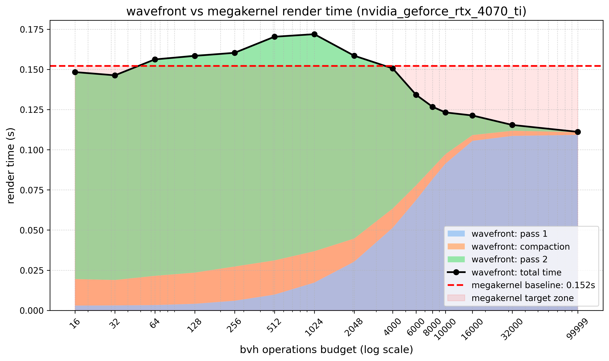
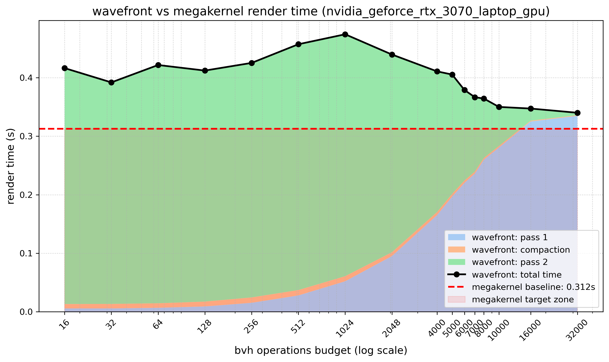
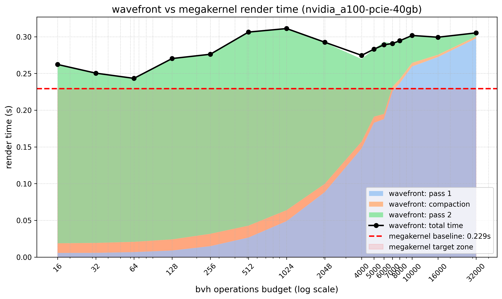

# Numba Raytracer

## Chapter 1: Introduction

### 1.1 Problem Definition
The objective of this project is to implement a CPU and Nvidia GPU ray-tracing engine in Python using Numba, capable of rendering complex 3D geometry such as million-triangle scenes. Ray tracing is inherently a highly parallel problem, as the light transport for each pixel can theoretically be calculated independently.

To briefly explain the steps of a generic raytracer: from each pixel of the desired resulting image, a 3D primary ray is cast into the scene. It either collides with triangles or escapes to infinity. Based on the material of the intersected triangle, the ray reflects or refracts, creating secondary rays. When the ray stops bouncing, shading is calculated by casting shadow rays from the final 3D hit point toward light-emitting sources to determine occlusion. This process relies on Monte Carlo integration to uniformly sample the light area. The final shading consists of diffuse and specular elements. Note that global illumination (ambient bounce light) is characteristic of a full path tracer; in a pure ray tracer, an occluded pixel receives no direct light and appears black, even if adjacent reflective materials would naturally contribute ambient light.

The core technical challenge of implementing a ray tracer lies in the high variance of the computational workload. Light rays performing deep glass refractions or trapped bounces inside detailed geometry require drastically more Bounding Volume Hierarchy (BVH) incidence tests than standard sky pixels that interact with nothing. This imbalance inevitably causes thread and warp divergence on parallel architectures.

### 1.2 Description of the Sequential Algorithm and Implementation
The foundational algorithm is a physically based ray tracer. For every pixel in the image frame, a primary ray traverses a static BVH to efficiently find triangle intersections. Upon intersection, the ray scatters according to surface material properties, repeating iteratively until it hits a light source, exceeds a maximum bounce limit, or experiences total light attenuation.

*Implementation via Numba* The engine utilizes the Numba Just-In-Time (JIT) compiler. By strictly avoiding dynamic memory allocations and packing all scene data (geometry, materials, and BVH nodes) into flat, C-style contiguous NumPy arrays, the core tracing loop was designed to be highly parallel-friendly. 

This memory-safe architecture allows the exact same intersection and shading math to scale seamlessly. A purely sequential approach can be easily converted to utilize multi-core CPUs via the `@njit(parallel=True)` decorator. By replacing this decorator with `@cuda.jit` and moving arrays to CUDA device allocations, the sequential loop transitions into a parallel single megakernel without requiring a total rewrite of the underlying math.

*Disadvantages of Python compared to C++* While Numba provides near-native execution speeds, choosing Python over a systems language like C++ introduces notable disadvantages in high-performance rendering:
* *Memory Control:* C++ offers explicit control over pointers, cache-line alignment, and hardware registers, which are critical for optimizing BVH traversal. Numba abstracts these low-level details away, making fine memory tuning difficult.
* *Data Structure Limitations:* Building and manipulating recursive, pointer-heavy tree structures directly on the device is highly restrictive in Numba CUDA compared to native C++, forcing heavy reliance on host-side preprocessing.
* *Host-Side Overhead:* Python's Global Interpreter Lock (GIL) and general runtime overhead complicate data preparation and stream compaction phases, creating CPU bottlenecks that would be trivial to multi-thread natively in C++.
* *Object-Oriented Programming Constraints:* Inside the kernel, no inheritance or custom classes were used. They are currently experimental in Numba and cause severe performance degradation. The code is structured in a strict C-style, utilizing functions and flat arrays instead of objects and pointers. While passing numerous parameters and manually casting floats is not Pythonic, it is currently the only way to maintain performance control in Numba.

***

## Chapter 2: GPU Implementation and Architectural Optimization

### 2.1 Transition to GPU and Baseline Benchmarks
The testing environments are based on the Cornell box with complex objects inserted. Initial local benchmarks were run on an RTX 3070 Mobile GPU and an 11th Gen Intel Core i7-11800H processor. To ensure statistical validity and filter out OS-level variance, all recorded render times in the following sections represent the median of 5 independent runs.

By structuring the scene data as flat arrays, the core ray-tracing loop was launched as a massively parallel megakernel. Initial benchmarks on the Dragon scene demonstrated a significant performance uplift compared to the CPU baselines.

| Mode           | Scene      | Cores/Block | Render Time (s) | Total Rays | Throughput (MRays/s) |
| :------------- | :--------- | :---------- | --------------: | ---------: | -------------------: |
| cpu-sequential | box-scaled | 1           |          3.8963 |  1,152,594 |                0.296 |
| cpu-sequential | dragon     | 1           |         21.5750 |  2,509,144 |                0.116 |
| cpu-parallel   | box-scaled | 16          |          2.4125 |  1,152,594 |                0.478 |
| cpu-parallel   | dragon     | 16          |          5.3934 |  2,509,144 |                0.465 |
| gpu            | dragon     | 8x8         |          0.2960 |  2,510,034 |                8.481 |
| gpu            | dragon     | 16x16       |          0.3293 |  2,509,867 |                7.622 |
| gpu            | dragon     | 32x32       |               - |          - |                    - |

*Baselines Overview:*
* CPU parallel mode successfully improves throughput across scenes (scaling up to 4.01x on the Dragon scene).
* The GPU Megakernel vastly outperforms the CPU implementation. On this specific hardware layout, the 8x8 block configuration outperformed 16x16 by roughly 11%.
* *The 32x32 Failure:* The 32x32 configuration failed with `CUDA_ERROR_LAUNCH_OUT_OF_RESOURCES`. This is a valid benchmark outcome demonstrating a hard launch resource limit. The megakernel simply requires too many physical hardware registers per thread to launch 1,024 threads simultaneously within a single block.

### 2.2 Profiling the Divergence Bottleneck
Despite the speedup over the CPU, baseline profiling using Nvidia Nsight Compute (NCU) revealed severe architectural inefficiency within the Megakernel.

| Metric                                   |               Value |
| :--------------------------------------- | ------------------: |
| Warp Cycles Per Issued Instruction       |         7.42 cycles |
| Warp Cycles Per Executed Instruction     |         7.44 cycles |
| *Avg. Active Threads Per Warp*           | *8.38 / 32 (26.2%)* |
| Avg. Not Predicated Off Threads Per Warp |   7.93 / 32 (24.8%) |

While profiling tools can sometimes obscure exact internal measurement methodologies, the metrics strongly indicate that the Megakernel averaged only *8.38 active threads per warp (~26.2%)*. This thread divergence occurs because the megakernel is not optimized for GPU warp execution. While most rays escape to the sky or hit simple geometry quickly, a minority of complex rays become trapped, forcing the rest of the warp to sit idle. Furthermore, NCU pointed to L1TEX scoreboard dependency waits as the primary stall reason, resulting from the chaotic memory reads inherent to BVH traversal. 

### 2.3 Wavefront Stream Compaction & The U-Curve
To mitigate this divergence, the algorithm was refactored into a two-pass *Wavefront (Stream Compaction)* architecture:

1. *Pass 1:* Enforces a strict BVH operations budget. Easy rays finish and terminate. Complex rays pause, spilling their exact state (ray origin, direction, accumulated color) to global device memory.
2. *CPU Compaction:* The Python host extracts the active ray indices using NumPy to create a dense array of unfinished work. Two sorting algorithms were tested (by material and by ray direction). Sorting by ray direction proved slightly worse in all cases. While a secondary CUDA kernel or CuPy could handle this, CPU sorting proved faster than the associated kernel launch overhead in Python.
3. *Pass 2 (Cleanup):* Relaunches exclusively over the compacted array, completing the deep bounces. 

An automated parameter sweep across the operations budget revealed a tradeoff between compute efficiency (resolving short rays early) and VRAM bandwidth overhead. The following data was gathered on an RTX 4070 Ti cluster node.

| Case                  | Ops Budget | Total Render (s) | Pass 1 Time | Compaction | Pass 2 Time | Active Rays |
| :-------------------- | :--------- | :--------------- | :---------- | :--------- | :---------- | :---------- |
| *Megakernel Baseline* | n/a        | 0.158            | -           | -          | -           | -           |
| Wavefront             | 128        | 0.1587           | 0.0041s     | 0.0190s    | 0.1362s     | 573,713     |
| Wavefront             | 1024       | 0.1737           | 0.0173s     | 0.0196s    | 0.1367s     | 422,440     |
| Wavefront             | 4000       | 0.1512           | 0.0512s     | 0.0117s    | 0.0878s     | 199,189     |
| Wavefront             | 8000       | 0.1251           | 0.0817s     | 0.0069s    | 0.0370s     | 86,184      |
| Wavefront             | 16000      | 0.1222           | 0.1058s     | 0.0038s    | 0.0126s     | 11,776      |
| Wavefront             | 32000      | 0.1166           | 0.1098s     | 0.0030s    | 0.0040s     | 22          |

*Wavefront vs megakernel render time (nvidia_geforce_rtx_4070_ti)*

As seen in the Ada Lovelace (RTX 4070 Ti) performance graph, increasing the budget shifts the workload from Pass 2 back to Pass 1. Around a budget of 4000, the total render time (0.151s) drops below the Megakernel baseline (0.158s) and enters the target zone. A budget of 8000 proved highly optimal for true Stream Compaction, successfully resolving ~97% of standard rays natively in Pass 1 and handing off only ~86,000 deep rays to Pass 2.

### 2.4 The "Chaos Kernel" Phenomenon
Despite the overall render time decreasing on newer hardware, profiling on Pass 2 revealed that warp efficiency actually worsened. Active threads dropped from the baseline 8.38 down to *4.68 per warp (~14.6%)*.

This phenomenon occurs because while stream compaction successfully groups active rays together, it completely destroys spatial memory access patterns. Adjacent threads in the newly compacted array now contain rays pointing in entirely different directions, hitting opposite sides of the BVH. This maximizes memory thrashing in the L1/L2 cache and exacerbates spatial divergence, proving that packing threads without proper sorting introduces severe secondary bottlenecks.

### 2.5 Data Locality: CPU Sorting and "The Shredder Effect"
To resolve spatial divergence, a material sorting phase was introduced between Pass 1 and Pass 2. 

Because the compacted array was relatively small, a "Skinny Round-Trip" strategy was utilized: transferring the indices to the CPU, running a dependency-free `numpy.argsort`, and transferring them back. This operation costs only a few milliseconds, proving highly viable compared to writing a native CUDA radix sort in Numba.

However, implementing the sort revealed another architectural trap: *The Shredder Effect*. Launching Pass 2 with the standard 2D block geometry (e.g., 16x16) forced the CUDA scheduler to map a 2D thread grid onto the newly sorted 1D array. This mapping effectively "shredded" the contiguous memory layout, nullifying the sort. To ensure the hardware respects the software sorting order, Pass 2 must utilize a strictly 1D execution model (`cuda.grid(1)`) with 1D block sizes.

### 2.6 Cross-Generational Hardware Anomalies (The Ampere Collapse)
During validation across different devices, a massive hardware-level anomaly emerged. The architecture was benchmarked on three different GPUs: an RTX 3070 Mobile (Ampere), an A100 40GB (Ampere), and an RTX 4070 Ti (Ada Lovelace).

*Wavefront vs megakernel render time (nvidia_geforce_rtx_3070_laptop_gpu)* 
*Wavefront vs megakernel render time (nvidia_a100-pcie-40gb)*

As shown in the Ampere graphs above, the total render time (black line) never reliably drops below the Megakernel baseline (red dashed line). Even on the enterprise-grade A100, the baseline of 0.229s was unbeatable by the Wavefront approach. Conversely, on the RTX 4070 Ti, the bounded Pass 1 kernel effortlessly shattered the baseline, reaching speeds near 0.11s.

To determine if the NVVM compiler was aggressively unrolling loops for newer architectures, the raw PTX assembly was extracted.

*PTX Assembly Extraction Analysis*

| Metric                        | Megakernel | Wavefront Pass 1 |
| :---------------------------- | :--------- | :--------------- |
| *Line Count*                  | 2,163      | 2,472            |
| *Branch Instructions (`bra`)* | 91         | 98               |
| *32-bit Registers (`%r`)*     | 56         | 132              |
| *64-bit Registers (`%rd`)*    | 527        | 825              |
| *Predicate Registers (`%p`)*  | 160        | 182              |
| *Float Registers (`%f`)*      | 1,244      | 1,333            |

*Architectural Conclusions:*
1. The compiler generated almost identical virtual assembly for both architectures, disproving the hypothetical compiler optimization.
2. The bounded kernel induced massive register pressure, jumping from 527 to 825 64-bit registers per thread.
3. The discrepancy likely lies in the PTX-to-SASS binary translation and the physical cache hierarchy. Ampere hardware (A100 and 3070) suffers from fatal register spilling to local memory under this 825-register footprint. The VRAM read/write overhead completely erases any compute cycles saved by Stream Compaction. The RTX 4070 Ti (Ada Lovelace), featuring a redesigned Streaming Multiprocessor and a massively expanded L2 cache, effortlessly absorbs the register pressure, resulting in superior execution speeds.

***

## Chapter 3: Conclusions

This project successfully demonstrated the implementation and micro-architectural profiling of a GPU-accelerated ray tracer using Python and Numba. The progression from a naive sequential CPU implementation to a massively parallel CUDA architecture yielded exponential performance improvements. 

Through rigorous profiling and parameter sweeping, several key conclusions were reached regarding modern rendering architectures:

1. *Numba is Viable, but Constrained:* Numba allows for rapid prototyping of GPU kernels using pure Python syntax, achieving near-native execution speeds. However, the lack of fine-grained memory control, missing native sorting algorithms, and high host-side synchronization overhead create hard ceilings for advanced optimizations like Stream Compaction.
2. *The Cost of Divergence vs. Memory:* The Wavefront architecture successfully isolates divergent, complex light paths. However, the VRAM bandwidth required to spill and reload ray states represents a massive overhead. Optimization is a delicate balancing act; pausing rays too early starves the compute cores, while pausing them too late renders the compaction useless.
3. *Hardware Dictates Software Strategy:* As evidenced by the "Ampere Collapse," an algorithm's success is heavily tied to the physical silicon. The exact same Wavefront codebase that achieved a 30% speedup on Ada Lovelace resulted in a performance loss on Ampere due to register spilling and cache limitations. Megakernels may still be the optimal choice for older or mobile architectures that cannot absorb high register pressure.

Future work on this engine would involve migrating the sorting logic entirely to the GPU using native radix sorts, implementing strictly 1D execution grids to respect memory locality, and potentially transitioning the codebase to C++ to bypass the limitations of Python's runtime overhead.
